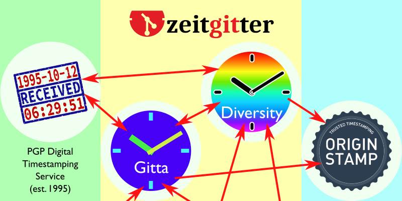

# List of public `zeitgitter` servers

## Access

| Nickname    | URL                               | Started    | Notes                   |
| ----------- | --------------------------------- | ---------- | ----------------------- |
| Gitta       | https://gitta.zeitgitter.net/     | 2019-04-01 | public                  |
| Diversity   | https://diversity.zeitgitter.net/ | 2019-04-04 | cross-timestamping only |

Diversity was chosen to use a slow timestamping mechanism, i.e. one which
timestamp servers are unlikely to use. This is used to achieve diversity in the
cryptographic algorithms used. Timestamping is one of the few applications
of cryptography where [offering different algorithms in parallel actually
increases robustness](./Cryptography.md#algorithm-diversity).

## Maintainer

| Nickname    | Country | Maintainer                      |
| ----------- | ------- | ------------------------------- |
| Gitta       | CH      | Andres Obrero, Marcel Waldvogel |
| Diversity   | CH      | Marcel Waldvogel                |

"Maintainer" includes everyone with access to the private key, i.e., anyone
who could fake a timestamp for this machine.

## Security parameters

| Nickname    | Algorithm | Key ID           | Interval | Offset | Timestamped by                  |
| ----------- | --------- | ---------------- | --------:| ------:| ------------------------------- |
| Gitta       | dsa3072   | 8A0B0941E7C49D65 |       1h | 23m37s | Diversity, stamper, originstamp |
| Diversity   | rsa4096   | 453E515FCB1593CB |       1h | 46m19s | Gitta, stamper, originstamp     |
| stamper     | rsa2046   | 70B61F81 (PGP 2) |       1d |  4h25m | Gitta, Diversity                |
| originstamp | Bitcoin   | Blockchain       |       1d |      — | —                               |

How to read this: Gitta commits, obtains a cross-timestamp from Diversity, and
publishes its log every hour, 23 minutes and 37 seconds after the hour.

## Publication locations

| Nickname    | Publication site                                             |
| ----------- | ------------------------------------------------------------ |
| Gitta       | [GitLab][gittalab], [GitHub][gittahub]                       |
| Diversity   | [GitLab][diverlab], [GitHub][diverhub]                       |
| stamper     | [GitLab][stamplab], [GitHub][stamphub], [own site][stampweb] |
| OriginStamp | [own site][origiweb]                                         |

[gittalab]: https://gitlab.com/zeitgitter/gitta-timestamps/
[gittahub]: https://github.com/zeitgitter/gitta-timestamps/
[diverlab]: https://gitlab.com/zeitgitter/diversity-timestamps/
[diverhub]: https://github.com/zeitgitter/diversity-timestamps/
[stamplab]: https://gitlab.com/zeitgitter/pgp-digital-timestamper-timestamped-archive/
[stamphub]: https://gitlab.com/zeitgitter/pgp-digital-timestamper-timestamped-archive/
[stampweb]: http://stamper.itconsult.co.uk/stamper-files/
[origiweb]: https://originstamp.org/timestamps

The *GitLab* and *GitHub* links can easily and efficiently be mirrored by
anyone interested in maintaining a local copy. The blockchain-like but
very efficient properties of `git` repositories allow resource-efficient
replication and prevents unnoticed modifications of the history of the
repostitory. The digital signatures of the timestamps guarantees an
effective means of verification in case someone attempts to rewrite
history.

# Special nicknames

## `stamper`

The special nickname `stamper` is used to refer to the [PGP Digital
Timestamping Service](http://www.itconsult.co.uk/stamper.htm),
established in 1995 by Matthew Richardson and still operated by him
on [Jersey](https://en.wikipedia.org/wiki/Jersey). Since 2019-03-09, the
[signature chain created by `stamper` is being archived on
GitLab](https://gitlab.com/zeitgitter/pgp-digital-timestamper-timestamped-archive)
and
[GitHub](https://github.com/zeitgitter/pgp-digital-timestamper-timestamped-archive).
Since 2019-04-03, this archive is being timestamped by Gitta and since
2019-05-26 also by Diversity.

I.e., the *PGP Digital Timestamper Timestamped Archive* is a normal
`git timestamp` client, which obtains regular timestamps on its daily commits.

After each hourly commit, Gitta and Diversity email their hashes file
(plus the ID of that commit) to `stamper`. As soon as the timestamped anser
email is received (shortly after the next even multiple of 5 minutes),
this timestamped answer is being added to the repository. Even though it
is published only about an hour later, the included third-party timestamp
ensures that it has not been modified between the issuance and the
publication.

## `originstamp`

`originstamp` is the Blockchain-based [OriginStamp](https://originstamp.org)
timestamping system. All commits by Diversity and Gitta are also included in
the records searchable at [`originstamp.org`](https://originstamp.org) and
committed up to a day later to the Bitcoin blockchain, as described by
OriginStamp.

OriginStamp does provide neither a receipt nor proof of posting which could be
added to the repository. Also, OriginStamp does not provide for an independent
archival of its issued timestamps, so there is no two-way timestamping.
